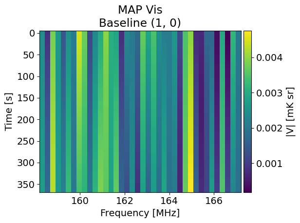

Maximum A Posteriori Calculations
=================================

BayesEoR includes a module, `bayeseor.analyze.maxap`, for performing Maximum A Posteriori (MAP) calculations.  The :class:`bayeseor.analyze.maxap.MaximumAPosteriori` class handles all of the setup and calculations and requires only a path to a configuration yaml file as input.  Please see :ref:`maxap-class` for more details.  Additional kwargs can be passed on instantiation for more advanced uses (see :ref:`addtl-uses` for more details).

Basic Usage
-----------

In the code block below, we compute the MAP visibilities for the test data provided with BayesEoR using the :class:`bayeseor.analyze.maxap.MaximumAPosteriori` class and plot a MAP visibility waterfall.

.. code-block:: python
    
    import numpy as np
    import matplotlib.pyplot as plt
    from bayeseor.analyze.maxap import MaximumAPosteriori

    # By default, no verbose output is printed. For verbose
    # output, add the verbose=True kwarg to the call below.
    maxap = MaximumAPosteriori(config="example-config.yaml")

    # Compute the MAP model coefficients, visibilities, and
    # log posterior probability for a given power spectrum.
    # This is the expected amplitude for P(k) for the test
    # data in units of mK^2 Mpc^3.
    map_coeffs, map_vis, log_post = maxap.map_estimate(
        ps=214777.66068216303
    )

    # Extract per-baseline visibilities from the MAP
    # visibility vector for comparison with the input data.
    bl_vis = maxap.extract_bl_vis(map_vis)

    # bl_vis is returned as a dictionary with keys of
    # baseline antenna pairs (ant1, ant2) or baseline index,
    # e.g. 0, 1, 2, if the antenna pairs are not present
    # in the instrument model.
    if "antpairs" in maxap.__dict__:
        key = maxap.antpairs[0]
    else:
        key = 0

    # Visualize a MAP visibility waterfall
    df = maxap.freqs[1] - maxap.freqs[0]
    extent_freq = [
        (maxap.freqs.min() - df/2).to("MHz").value,
        (maxap.freqs.max() + df/2).to("MHz").value
    ]
    dt = (maxap.jds[1] - maxap.jds[0]).to("s")
    extent_time = [
        -(dt/2).to("s").value,
        (maxap.jds[-1] - maxap.jds[0] + dt/2).to("s").value
    ]
    fig, ax = plt.subplots()
    ax.set_title(f"MAP Vis\nBaseline {key}")
    ax.set_ylabel("Time [s]")
    ax.set_xlabel("Frequency [MHz]")
    im = ax.imshow(
        np.abs(bl_vis[key]),
        extent=extent_freq+extent_time[::-1],
        aspect="auto"
    )
    cb = fig.colorbar(im, ax=ax, pad=0.01)
    cb.set_label("|V| [mK sr]")
    fig.tight_layout()

.. warning::

    The :class:`bayeseor.analyze.maxap.MaximumAPosteriori` class calls `bayeseor.setup.run_setup` as part of `__init__`.  This will build the matrix stack, which is required for MAP calculations, if it doesn't already exist at the array directory path created from the configuration yaml file.

The above code will produce the following simple plot of the absolute value of the MAP visibilities for baseline (1, 0).

.. _addtl-uses:

Additional Uses
---------------

The :class:`bayeseor.analyze.maxap.MaximumAPosteriori` class also allows accepts `data_path` and `array_dir` kwargs which allow the user to specify a data file and/or array directory that differs from that in the specified config file.  This is useful for testing different model configurations for the same data, by specifying `array_dir`, or testing model viability using different datasets, by specifying `data_path`.  Specifying either `data_path` or `array_dir` will add a bit of computational overhead as we need to recompute the necessary matrices/vectors used in the posterior calculation.