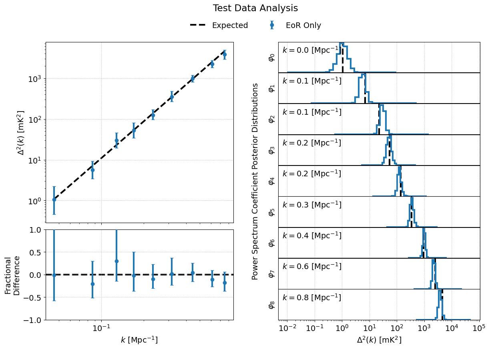
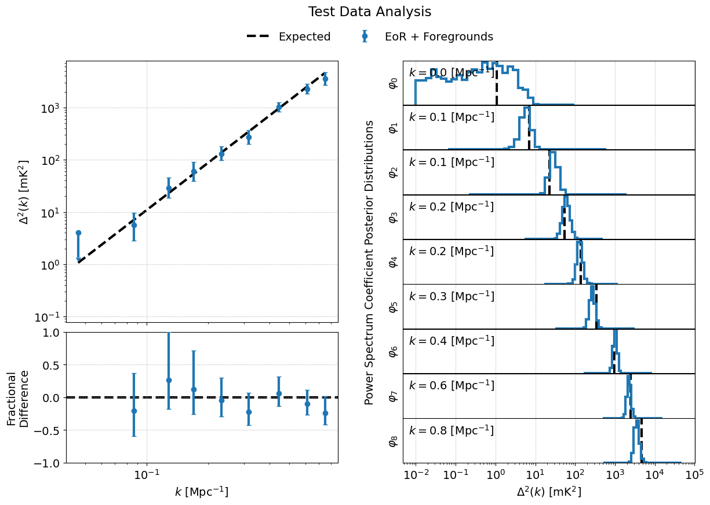

.. _test-data:

Test Datasets
=============

The BayesEoR repository provides a set of test data and yaml configuration files for two simulated datasets: EoR only (``test_data/eor/``) and EoR + foregrounds (``test_data/eor_fgs/``).  Both datasets share some common components described in the table below, :ref:`sim-params`.  For more details on the simulated test data, please see Section 3 of `Burba et al. 2023a <https://ui.adsabs.harvard.edu/abs/2023MNRAS.520.4443B/abstract>`_.

.. _sim-params:

.. table:: Common simulation parameters
    :widths: auto

    ======================= ==========
    Parameter               Value
    ======================= ==========
    Minimum frequency       158.30 MHz
    Frequency channel width 237.62 kHz
    Number of frequencies   38
    Minimum time (JD)       2458098.30
    Integration time        11 s
    Number of times         34
    Beam type               Gaussian
    Beam FWHM               9.3 deg
    Number of baselines     15
    Maximum baseline length 38.63 m
    ======================= ==========

Instructions on using each test dataset are described below.

.. _eor-only:

EoR Only
--------

The EoR-only test data, ``test_data/eor/eor.uvh5``, contain simulated visibilities of a mock EoR signal drawn as a Gaussian-random field with a flat power spectrum

.. math::

    P(k) = 214777.66068216303\ \rm{mK}^2\,\rm{Mpc}^3

BayesEoR outputs the dimensionless power spectrum, :math:`\Delta^2(k)`, which can be obtained from :math:`P(k)` via

.. math::

    \Delta^2(k) = \frac{k^3}{2\pi^2}\,P(k)

The :math:`k` bin values required to obtain the dimensionless power spectrum are written to disk automatically by BayesEoR in the same directory as the sampler outputs (please see :ref:`output-location` or :ref:`post-analysis-class` for more information).

Analysis Parameters
^^^^^^^^^^^^^^^^^^^

A yaml configuration file has been provided which can be used to run the EoR-only test data analysis, ``test_data/eor/config.yaml``:

.. literalinclude:: ../test_data/eor/config.yaml
    :language: yaml

This yaml contains the minimum sufficient set of parameters to run an EoR only analysis.  The input data in this case are visibilities in a ``pyuvdata``-compatible file (``test_data/eor/eor.uvh5``).  The frequency-axis parameters, ``freq_min`` (``--freq-min``), ``nf`` (``--nf``), and ``df`` (``-df``), and time-axis parameters, ``jd_min`` (``--jd-min``), ``nt`` (``--nt``), and ``dt`` (``--dt``), will all be extracted automatically from the input ``pyuvdata``-compatible file, so they need not be explicitly specified in the configuration yaml.  Because we are analyzing a ``pyuvdata``-compatible file, there is also no need to specify an instrument model directory, ``inst_model`` (``--inst-model``).  The instrument model will be generated at runtime using the baselines in ``test_data/eor/eor.uvh5``.

.. warning::
    The provided test data are simulated from a rectangular patch of sky with an arc length of 12.9 deg on each side.  In the provided configuration yaml, we thus set ``simple_za_filter = False`` to use a rectangular FoV in the BayesEoR image-space model.  In general, we discourage using a rectangular FoV in the image-space model (please see BayesEoR issue `#11 <https://github.com/PSims/BayesEoR/issues/11>`_ for more details).  In this particular case, the rectangular FoV is not an issue.  When analyzing other datasets, we highly recommend setting ``simple_za_filter = True``, its default value, to avoid any issues with rectangular FoV pixel selections.  Please see Section 3 of `Burba et al. 2023a <https://ui.adsabs.harvard.edu/abs/2023MNRAS.520.4443B/abstract>`_ for more details.

Build the Matrix Stack
^^^^^^^^^^^^^^^^^^^^^^

To build the matrices (which will require ~17 GB of RAM and ~12 GB of disk space) using the provided example configuration yaml and test data, first navigate to the root directory of the BayesEoR repository.  Then, run the following command

.. code-block:: Bash

    python scripts/run-analysis.py --config test_data/eor/config.yaml --cpu

The matrices will be stored in ``matrices/`` in the current working directory.

.. tip::
    If you wish to change the location in which the matrices are stored, specify the ``array_dir_prefix`` (``--array-dir-prefix``) argument in the configuration yaml (on the command line).  Please see :ref:`setting-parameters` for more details.

Run the Power Spectrum Analysis
^^^^^^^^^^^^^^^^^^^^^^^^^^^^^^^

Once the matrices are built, you can run the power spectrum analysis (which will require ~12 GB of RAM) via

.. code-block:: Bash

    python scripts/run-analysis.py --config test_data/eor/config.yaml --gpu --run

The sampler outputs will be stored in ``chains/MN-15-15-38-0-2.63-2.82-6.2E-03-lp-dPS-v1/``.

.. tip::
    If you wish to change the location in which the sampler outputs are stored, specify the ``output_dir`` (``--output-dir``) argument in the configuration yaml (on the command line).  Please see :ref:`setting-parameters` for more details.

Analyze the Outputs
^^^^^^^^^^^^^^^^^^^

We can use the :class:`bayeseor.analyze.analyze.DataContainer` class to quickly analyze the outputs of the power spectrum analysis via

.. code-block:: python

    from bayeseor.analyze import DataContainer

    dir_prefix = "./chains/"
    dirnames = ["MN-15-15-38-0-2.63-2.82-6.2E-03-lp-dPS-v1/"]
    expected_ps = 214777.66068216303  # mK^2 Mpc^3

    data = DataContainer(
        dirnames,
        dir_prefix=dir_prefix,
        expected_ps=expected_ps,
        labels=["EoR Only"]
    )
    fig = data.plot_power_spectra_and_posteriors(
        suptitle="Test Data Analysis",
        plot_fracdiff=True,
        cred_interval=95
    )

.. attention::
    If you changed the location in which the sampler outputs are stored, you will need to update ``dir_prefix`` in the above code block to point to your specified output directory.

.. tip::
    The :class:`bayeseor.analyze.analyze.DataContainer` class calculates credibility intervals via the ``cred_intervals`` kwarg.  You can specify any credibility intervals of interest as an e.g. list of percentages.  By default, the 68% and 95% credibility intervals are calculated for each :math:`k` bin.  You can choose which credibility interval to plot as the uncertainty on each :math:`k` bin in :meth:`bayeseor.analyze.analyze.DataContainer.plot_power_spectra_and_posteriors` via the ``cred_interval`` kwarg.

This should produce the following figure if the analysis has been run correctly:

EoR and Foregrounds
-------------------

The EoR + foregrounds test data, ``test_data/eor_fgs/eor_and_fgs.uvh5``, contain simulated visibilities of the aforementioned mock EoR signal (:ref:`eor-only`) plus diffuse and point source foregrounds.  The diffuse component is the 2016 Global Sky Model (GSM) from `Zheng et al. 2016 <https://ui.adsabs.harvard.edu/abs/2017MNRAS.464.3486Z/abstract>`_ generated via `PyGDSM <https://github.com/telegraphic/pygdsm>`_.  The point source component is a modified version of the GaLactic and Extragalactic All-sky MWA Survey (GLEAM) from `Wayth et al. 2015 <https://ui.adsabs.harvard.edu/abs/2015PASA...32...25W/abstract>`_.  Please see section 3.2.2 of `Burba et al. 2023a <https://ui.adsabs.harvard.edu/abs/2023MNRAS.520.4443B/abstract>`_ for the details of the modifications made to the GLEAM catalog.

Analysis Parameters
^^^^^^^^^^^^^^^^^^^

A yaml configuration file has been provided which can be used to run the EoR + foregrounds test data analysis, ``test_data/eor_fgs/config.yaml``:

.. literalinclude:: ../test_data/eor_fgs/config.yaml
    :language: yaml

This yaml contains the minimum sufficient set of parameters to run a joint EoR + foreground analysis.  The only additional inputs that differ from the corresponding EoR-only configuration yaml are the inclusion of ``nq`` (``--nq``), ``beta`` (``--beta``), and ``fit_for_monopole`` (``--fit-for-monopole``).  These arguments specify the number of Large Spectral Scale Model (LSSM) basis vectors, the brightness temperature power law spectral indices for the LSSM basis vectors, and to fit for the :math:`(u, v) = (0, 0)` coefficient for each :math:`\eta`, respectively.  These three parameters comprise the minimum sufficient set of parameters to model foregrounds.

Like the :ref:`eor-only` case above, the frequency and time axis parameters and the instrument model will be created at runtime because we are reading the input data from a ``pyuvdata``-compatible file.

.. warning:: 
    The provided test data are simulated from a rectangular patch of sky with an arc length of 12.9 deg on each side.  In the provided configuration yaml, we thus set ``simple_za_filter = False`` to use a rectangular FoV in the BayesEoR image-space model.  In general, we discourage using a rectangular FoV in the image-space model (please see BayesEoR issue `#11 <https://github.com/PSims/BayesEoR/issues/11>`_ for more details).  In this particular case, the rectangular FoV is not an issue.  When analyzing other datasets, we highly recommend setting ``simple_za_filter = True``, its default value, to avoid any issues with rectangular FoV pixel selections.  Please see Section 3 of `Burba et al. 2023a <https://ui.adsabs.harvard.edu/abs/2023MNRAS.520.4443B/abstract>`_ for more details.

.. tip::
    The EoR and foreground models need not have the same FoV values in model image space or ``nu`` and ``nv`` in the model uv-plane.  The foreground model has its own set of specifiable analysis parameters for the FoV in the image-space model ``fov_ra_fg`` (``--fov-ra-fg``) and ``fov_dec_fg`` (``--fov-dec-fg``), and the foreground model uv-plane, ``nu_fg`` (``--nu-fg``) and ``nv_fg`` (``--nv-fg``).  In this way, we can model the EoR component within e.g. the primary FoV of the telescope and foregrounds out to higher zenith angles.  Please see `Burba et al. 2023b <https://ui.adsabs.harvard.edu/abs/2023ursi.confE.259B/abstract>`_ for a demonstration of BayesEoR configured with separate FoV values for the EoR and foreground models.

Build the Matrix Stack
^^^^^^^^^^^^^^^^^^^^^^

To build the matrices (which will require ~17 GB of RAM and ~12 GB of disk space) using the provided example configuration yaml and test data, first navigate to the root directory of the BayesEoR repository.  Then, run the following command

.. code-block:: Bash

    python scripts/run-analysis.py --config test_data/eor_fgs/config.yaml --cpu

The matrices will be stored in ``matrices/`` in the current working directory.

.. tip::
    If you wish to change the location in which the matrices are stored, specify the ``array_dir_prefix`` (``--array-dir-prefix``) argument in the configuration yaml (on the command line).  Please see :ref:`setting-parameters` for more details.

Run the Power Spectrum Analysis
^^^^^^^^^^^^^^^^^^^^^^^^^^^^^^^

Once the matrices are built, you can run the power spectrum analysis (which will require ~12 GB of RAM) via

.. code-block:: Bash

    python scripts/run-analysis.py --config test_data/eor_fgs/config.yaml --gpu --run

The sampler outputs will be stored in ``chains/MN-15-15-38-2-ffm-2.63-2.82-6.2E-03-lp-dPS-v1/``.

.. tip::
    If you wish to change the location in which the sampler outputs are stored, specify the ``output_dir`` (``--output-dir``) argument in the configuration yaml (on the command line).  Please see :ref:`setting-parameters` for more details.

Analyze the Outputs
^^^^^^^^^^^^^^^^^^^

We can use the :class:`bayeseor.analyze.analyze.DataContainer` class to quickly analyze the outputs of the power spectrum analysis via

.. code-block:: python

    from bayeseor.analyze import DataContainer

    dir_prefix = "./chains/"
    dirnames = ["MN-15-15-38-2-ffm-2.63-2.82-6.2E-03-lp-dPS-v1/"]
    expected_ps = 214777.66068216303  # mK^2 Mpc^3

    data = DataContainer(
        dirnames,
        dir_prefix=dir_prefix,
        expected_ps=expected_ps,
        labels=["EoR + Foregrounds"]
    )

    uplim_inds = np.zeros((1, data.k_vals[0].size), dtype=bool)
    uplim_inds[0, 0] = True
    fig = data.plot_power_spectra_and_posteriors(
        suptitle="Test Data Analysis",
        plot_fracdiff=True,
        cred_interval=95,
        uplim_inds=uplim_inds
    )

Note that, in the code block above, we added an additional kwarg, ``uplim_inds``.  For the provided EoR + foregrounds test dataset, the posterior in the lowest :math:`k` bin produces a non-detection.  For any non-detections, we can plot the upper limit, as the 95-th percentile, by using ``uplim_inds`` which acts like a mask.  Any entries in ``uplim_inds`` which are True (False) will be plotted as an upper limit (detection: median plus credibility interval).  ``uplim_inds`` must be a boolean ``numpy.ndarray`` with shape ``(len(dirnames), Nkbins)`` where ``Nkbins`` is the number of :math:`k` bins in the analysis.

.. attention::
    If you changed the location in which the sampler outputs are stored, you will need to update ``dir_prefix`` in the above code block to point to your specified output directory.

.. tip::
    The :class:`bayeseor.analyze.analyze.DataContainer` class calculates credibility intervals via the ``cred_intervals`` kwarg.  You can specify any credibility intervals of interest as an e.g. list of percentages.  By default, the 68% and 95% credibility intervals are calculated for each :math:`k` bin.  You can choose which credibility interval to plot as the uncertainty on each :math:`k` bin in :meth:`bayeseor.analyze.analyze.DataContainer.plot_power_spectra_and_posteriors` via the ``cred_interval`` kwarg.

This should produce the following figure if the analysis has been run correctly:

