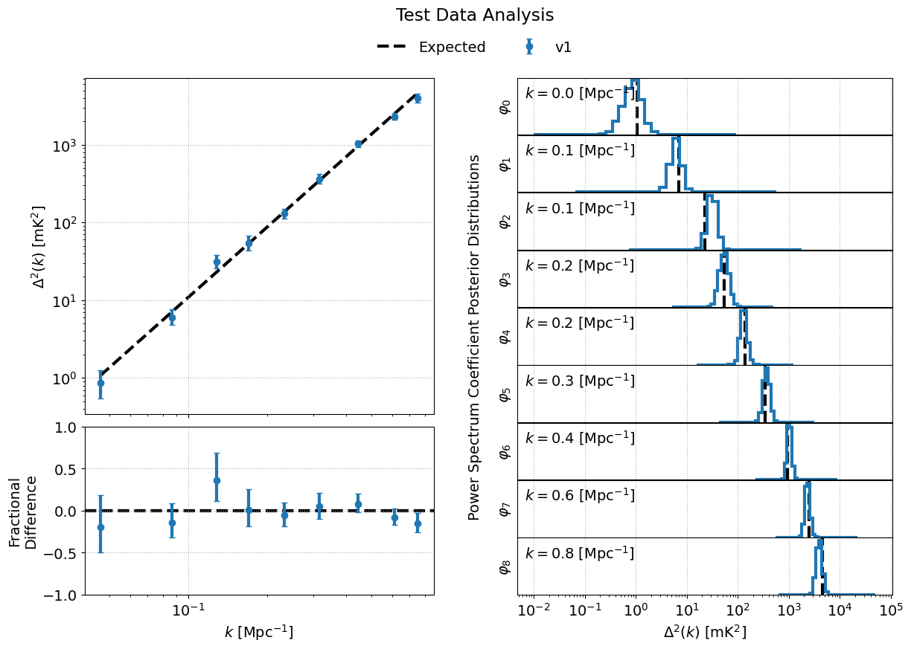

.. _running-bayeseor:

Running BayesEoR
================

``run-analysis.py`` provides an example driver script for running BayesEoR.  This file contains all of the necessary steps to set up the :class:`bayeseor.posterior.PowerSpectrumPosteriorProbability` class and to run MultiNest and obtain power spectrum posteriors.

There are currently three steps involved in a BayesEoR analysis

1. Preprocess the data and generate an instrument model (uses only CPUs)
2. Build the required matrices (uses only CPUs, no GPUs required)
3. Run the power spectrum analysis (double precision GPUs required)

Below, we provide some useful information about the required :ref:`inputs` and these :ref:`analysis-steps`.  For additional help with running BayesEoR and setting analysis parameters, please see :ref:`setting-parameters`.  More information on running BayesEoR can also be found below in :ref:`test-data`.

.. _inputs:

Inputs
------

BayesEoR requires the following as inputs to run a power spectrum analysis:

1. Input data
2. Instrument model
3. A set of analysis and model parameters

More information about each of these components can be found below.

Input Data
^^^^^^^^^^

The input dataset is expected to be a `numpy`-compatible, complex, one-dimensional vector of visibilities with shape `(Nvis,)`.  Here, `Nvis = Nbls * Ntimes * Nfreqs` is the total number of visibilities and `Nbls`, `Ntimes`, and `Nfreqs` is the number of baselines, times, and frequencies in the data.  The ordering of the visibilities for each baseline, frequency, and time in this one-dimensional vector is arbitrary.  However, this order must align with the ordering of the baselines in the instrument model (more on this below in :ref:`preprocessing-the-data`).

Instrument Model
^^^^^^^^^^^^^^^^
The instrument model is comprised of several components

1. "uv sampling": the specific `(u, v, w)` coordinates sampled by each baseline with shape `(Ntimes, Nbls, 3)`
2. Redundancy model: the number of baselines which sample each `(u, v, w)` coordinate in the uv sampling with shape `(Ntimes, Nbls, 1)`
3. Primary beam model: either a path to a `UVBeam <https://github.com/RadioAstronomySoftwareGroup/pyuvdata>`_-compatible file or a string specifying an analytic beam profile (please see :class:`bayeseor.model.healpix.Healpix` for details on supported analytic beam types and their associated parameters)
4. Phasor vector (optional): an array which phases the visibilities as a function of time with shape `(Nvis,)`

Quantities 1-3 are required in every analysis.  Quantity 4, the phasor vector, is optional and is only used if modelling phased visibilities.  In our experience, we have found that we recover more accurate model visibilities when the data and model are unphased.  For this reason, we suggest modelling unphased visibilities and excluding the phasor vector from the instrument model.

The uv sampling, redundancy model, and optional phasor vector can all be generated using the provided data preprocessing script ``scripts/data_preprocessing.py``.  Please see the section below on :ref:`preprocessing-the-data` for more information.

Choosing Analysis and Model Parameters
^^^^^^^^^^^^^^^^^^^^^^^^^^^^^^^^^^^^^^

The example configuration file (`example-config.yaml`) provides an example of the minimum required analysis and model parameters which must be specified by the user for a power spectrum analysis.  Please see :ref:`setting-parameters` for the contents of this file and :class:`bayeseor.params.BayesEoRParser` for a description of each of the user-definable analysis parameters.  This information can also be displayed by running

.. code-block:: Bash

    python run-analysis.py --help

As stated in :ref:`setting-parameters`, all of these parameters can be set via a configuration yaml file (recommended) or via the command line.

Some of these parameters have quite obvious values.  For example, ``nf`` and ``nt`` are simply the number of frequencies and times in the data being analyzed, respectively.  Other parameters require a little more care.  The parameters ``nu`` (the number of sampled Fourier modes along the u axis of the model uv plane) and ``fov_ra_eor`` (the field of view of the sky model along the right ascension axis) must be chosen more carefully.  In addition to the field of view of the sky model, ``fov_ra_eor`` also determines the spacing between adjacent modes along the u axis of the model uv plane.  The value of ``nu`` must therefore be chosen to fully encompass the u coordinates sampled by the baseline in the input data.  The beam must also be taken into account when choosing ``nu`` for a given ``fov_ra_eor`` as the beam effects the extent of the uv plane sampled by each baseline.  The same arguments apply when choosing ``nv`` and ``fov_dec_eor`` as these quantities correspond to the v axis of the model uv plane and the declination axis of the sky model, respectively.  Please see section 2.3 of `Burba et al. 2023 <https://ui.adsabs.harvard.edu/abs/2023MNRAS.520.4443B/abstract>`_ for a more detailed discussion on choosing model parameters.

.. _analysis-steps:

Analysis Steps
--------------

.. _preprocessing-the-data:

Preprocessing the Data
^^^^^^^^^^^^^^^^^^^^^^
We have provided a script ``scripts/data_preprocessing.py`` which takes a `pyuvdata <https://github.com/RadioAstronomySoftwareGroup/pyuvdata>`_-compatible file containing visibilities for each baseline, time, and frequency and generates the following `numpy`-compatible files

1. A one-dimensional visibility data vector
2. An instrument model comprised of
    a. ``uvw_model.npy``: the "uv sampling" or `(u, v)` coordinates sampled by each baseline
    b. ``redundancy_model.npy``: the redundancy of each baseline
    c. ``phasor_vector.npy`` (optional): a phasor vector which is used to phase the model visibilities as a function of time

It is also possible to store the instrument model as a python dictionary instead of separate files as indicated above.  In the case of a dictionary, the uv sampling, redundancy model, and optional phasor vector must all be indexed by the keys ``'uvw_model'``, ``'redundancy_model'``, and ``'phasor_vector'``, respectively.  Please see ``bayeseor.model.instrument.load_inst_model`` for more details.

The provided data preprocessing script also uses ``jsonargparse`` for the command line interface.  All of the command line arguments can thus be specified either via a configuration yaml file or via the command line directly.  For a description of each of the command line arguments please see

.. code-block:: Bash

    python data_preprocessing.py --help

Note that this step is not required when running the test data (:ref:`test-data`) as the test data have already been run through the preprocessing script.

Building the Matrix Stack
^^^^^^^^^^^^^^^^^^^^^^^^^

If using a configuration file (recommended), the driver script can be run to build the matrices via

.. code-block:: Bash
    
    python run-analysis.py --config /path/to/config.yaml --cpu

Note that with ``jsonargparse``, command line arguments that come after the ``--config`` flag overwrite the value of the argument in the configuration file.  In the example above, the ``--cpu`` flag placed after the ``--config`` flag will force the code to use CPUs only.

BayesEoR automatically creates a directory in which to store the matrix stack if one does not already exist.  The name of the matrix stack directory is set automatically based on the chosen analysis parameters.  The prefix for this matrix stack directory can be set via the ``array_dir_prefix`` argument in the configuration yaml or the ``--array-dir-prefix`` flag on the command line.  The matrix stack is saved in a subdirectory within ``array_dir_prefix``.  The default matrix stack prefix is `./array-storage/`.

Running the Power Spectrum Analysis
^^^^^^^^^^^^^^^^^^^^^^^^^^^^^^^^^^^

Once the matrices are built, you can run the power spectrum analysis (which requires double precision GPUs) via

.. code-block:: Bash
    
    python run-analysis.py --config /path/to/config.yaml --gpu

As above, the trailing ``--gpu`` flag will force the code to use GPUs.  The power spectrum analysis will only run if at least one GPU is found and the GPU initialization is succesful.

.. _output-location:

Outputs
-------

The location for the outputs of a BayesEoR analysis can be set via the ``output_dir`` argument in the configuration yaml or the ``--output-dir`` flag on the command line.  The output files from BayesEoR will be placed in a subdirectory of ``output_dir`` and the name of the subdirectory is set automatically based on the chosen analysis parameters.  The default output directory prefix is `./chains/`.

BayesEoR outputs a few key files:

#. ``args.json``: This file contains all of the configuration / command line arguments used for each analysis.

#.  ``k-vals*.txt``: These files contain information about the spherically-averaged k bins.

    * ``k-vals.txt``: average magnitude of all k in each k bin

    * ``k-vals-bins.txt``: bin edges of each k bin

    * ``k-vals-nsamples.txt``: number of model k-cube voxels included in each k bin

#.  ``data-*``: These files contain the outputs of the sampler, the most important being ``data-.txt``.  This file contains the sampler output and has the power spectrum amplitude samples for each iteration.  For MultiNest outputs, this file has `Nkbins` + 2 columns where `Nkbins` is the number of spherically-averaged k bins.  The columns of interest in this file are the columns with index 0 and >= 2.  The 0th column contains the joint posterior probability value per iteration.  The columns with index >= 2 contain the power spectrum amplitude samples for each k bin.

For convenience, we have provided a class to aid in analyzing the aforementioned outputs of BayesEoR.  For more information on this class, please see :ref:`post-analysis-class`.

.. _test-data:

Test Dataset
------------

The BayesEoR repository provides a set of test data and an example yaml configuration file.  The test data contain mock EoR only simulated visibilities with a Gaussian beam and a full width at half maximum of 9.3 degrees.  For more information on the test data, see Section 3 of `Burba et al. 2023 <https://ui.adsabs.harvard.edu/abs/2023MNRAS.520.4443B/abstract>`_.

To build the matrices (which will require ~17 GB of RAM and ~17 GB of disk space) using the provided example configuration yaml and test data, first navigate to the root directory of the BayesEoR repository and run

.. code-block:: Bash

    python run-analysis.py --config example-config.yaml --cpu

Note that, by default, the matrices will be stored in ``array-storage/`` inside the BayesEoR repository.  If you wish to change the location in which the matrices (or outputs) are stored, please see :ref:`setting-parameters`.  Once the matrices are built, you can run the power spectrum analysis (which will require ~12 GB of RAM) via

.. code-block:: Bash

    python run-analysis.py --config example-config.yaml --gpu

The mock EoR signal in the provided test data was generated as Gaussian white noise which has a flat power spectrum, `P(k) = 214777.66068216303 mK^2 Mpc^3`.  BayesEoR outputs the dimensionless power spectrum which can be obtained from `P(k)` via e.g. Equation 13 `Burba et al. 2023 <https://ui.adsabs.harvard.edu/abs/2023MNRAS.520.4443B/abstract>`_.  The `k` bin values required to obtain the dimensionless power spectrum are written to disk automatically by BayesEoR in the same directory as the sampler outputs (please see :ref:`output-location` or :ref:`post-analysis-class` for more information).

.. _post-analysis-class:

Analyzing BayesEoR Outputs
--------------------------

We have provided a basic class for analyzing the outputs of BayesEoR.  The minimum requirement to instantiate the class is a list of directory names containing the BayesEoR output files.  There are also several kwargs you can set to calculate various quantities, compare the results with an expected power spectrum, and/or modify the attributes of the created plots.  Please see :ref:`datacontainer-class-def` below for more information.

As an example, let us consider the case of analyzing the outputs of an analysis using the provided test data.

.. code-block:: python

    from pathlib import Path
    from bayeseor.utils.analyze_results import DataContainer

    dir_prefix = Path('./chains/')
    dirnames = ['MN-Test-15-15-38-0-2-6.2E-03-2.63-2.82-lp-dPS-v1']
    expected_ps = 214777.66068216303  # mK^2 Mpc^3

    data = DataContainer(
        dirnames, dir_prefix=dir_prefix, expected_ps=expected_ps, labels=['v1']
    )
    fig = data.plot_power_spectra_and_posteriors(
        suptitle='Test Data Analysis', plot_fracdiff=True
    )

In this example, we've assumed the default output location `./chains/`.  The subdirectory containing the BayesEoR output files is `./chains/MN-Test-15-15-38-0-2-6.2E-03-2.63-2.82-lp-dPS-v1/`.  Here, we are only analyzing the output from a single analysis.  If you wish to compare multiple analyses within the same directory, i.e. you have multiple subdirectories containing output files in `./chains/`, you can add more entries to `dirnames` e.g.

.. code-block:: python

    dirnames = ['MN-Test-15-15-38-0-2-6.2E-03-2.63-2.82-lp-dPS-v1',
                'MN-Test-15-15-38-0-2-6.2E-03-2.63-2.82-lp-dPS-v2',
                'MN-Test-15-15-38-0-2-6.2E-03-2.63-2.82-lp-dPS-v3']

The variable ``expected_ps`` in the example above has been set specifically for the test dataset.  The mock EoR signal in the test dataset has a flat power spectrum, P(k) (more info in the section above on the :ref:`test-data`).  We thus only need to specify a floating point number for the expected P(k).  The class will internally convert this P(k) into the dimensionless power spectrum, or vice versa, based on the combination of the ``ps_kind`` kwarg (``'ps'`` for power spectrum or ``'dmps'`` for the dimensionless power spectrum) and the ``expected_ps`` or ``expected_dmps`` kwargs.  The default value of ``ps_kind`` is ``'dmps'``, but we've passed the class the ``expected_ps`` kwarg corresponding to the power spectrum.  The class will thus automatically convert this floating point P(k) into the corresponding dimensionless power spectrum using the k bins files in each output directory.

The ``DataContainer`` class also provides a few plotting functions.  In the example above, we're using the ``plot_power_spectra_and_posteriors`` function which creates a summary plot containing a subplot for the power spectrum estimates, an optional difference or fractional difference subplot if providing a known input power spectrum, and a subplot for the posterior of each k bin.  This code snippet will produce the following output if the analysis has been run correctly:

.. _datacontainer-class-def:

DataContainer Class Definition
^^^^^^^^^^^^^^^^^^^^^^^^^^^^^^

.. autoclass:: bayeseor.utils.analyze_results.DataContainer
    :members:
